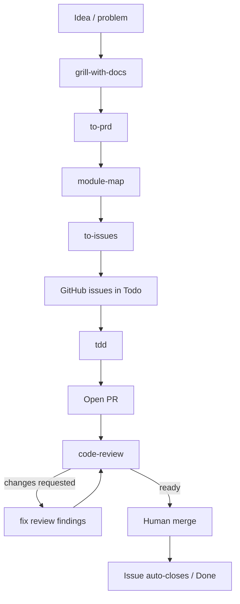

# AI-Assisted Software Development: Core Principles

The *why* behind the workflow. The *how* lives in [CONTRIBUTING.md](../CONTRIBUTING.md); each skill documents itself in `.claude/skills/`.

---

## 1. Context is the scarce resource

- LLMs have ~100k tokens of usable "smart zone." Quality degrades past that.
- Clearing context preserves reproducibility (same input → same state). Compacting trades that for continuity.
- Prefer clearing with fresh strategic prompts over compacting across phases.
- Size tasks to stay inside the smart zone. Run each skill in its own session.

---

## 2. Reach shared understanding before specs

Specs-to-code fails when alignment is silent — the agent over-commits with hidden assumptions. Grilling (relentless one-question-at-a-time interviewing) surfaces 40–80 decisions before code exists. The artifacts (`CONTEXT.md`, ADRs, PRD) are downstream of that conversation, not a substitute.

Don't review the PRD deeply — you already aligned during grilling. The PRD only proves the AI can summarize.

---

## 3. Vertical slices, not horizontal

LLMs naturally code horizontally (all DB, then all API, then all UI). Feedback only arrives at the end. Tracer-bullet slices cross every layer end-to-end so feedback arrives on each merge.

The same rule applies inside a slice: one test → one implementation → repeat. Writing all tests first produces tests that describe *imagined* behavior.

---

## 4. Deep modules

Small interface, lots hidden behind it. Shallow modules (interface ≈ implementation) are what LLMs produce by default — and what make codebases hard to test and hard to navigate. Define the shape in a module map up front; let the implementation hide inside.

Full vocabulary in [`.claude/skills/improve-codebase-architecture/LANGUAGE.md`](../.claude/skills/improve-codebase-architecture/LANGUAGE.md).

---

## 5. End-to-end flow

**Skill sequence:**
1. `grill-with-docs` — shared understanding
2. `to-prd` — destination issue
3. `module-map` — architecture anchors
4. `to-issues` — vertical slices
5. `tdd` — implementation
6. `code-review` — merge gate

Review fixes are not a new skill: only resolve `code-review` findings.

`improve-codebase-architecture` runs out-of-band — invoke when friction accumulates (shallow modules, hard-to-test seams). Its output feeds the normal slice → TDD → review flow.

---

## 6. Push vs pull for standards

| Phase          | Approach                    | Reason                              |
| -------------- | --------------------------- | ----------------------------------- |
| Implementation | Pull (skills, references)   | Agent should explore options        |
| Review         | Push (standards in prompt)  | Reviewer needs direct comparison    |

QA stays manual — it's where taste lives. Failures from QA create new issues, not silent fixes.

---

## Key insight

Fundamentals still hold. AI changes execution speed, not principles. Better architecture, tests, and clarity → better AI output. Bad codebases stay bad regardless of capability.
